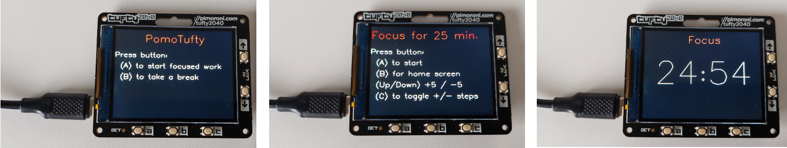

# PomoTufty

A pomodoro timer for the Tufty 2040

## Installation Instructions

Upload <em>main.py</em> and the directory <em>pomotuftyclasses</em> to your Tufty 2040.

If you already have a main.py file on your device, back it up first!

## Remarks

 * I'm a programmer, but I'm not used to program in Python.
 * I tried to implement the model-view-controller (MVC) pattern
 * Feel free to fork, improve, submit pull requests!

